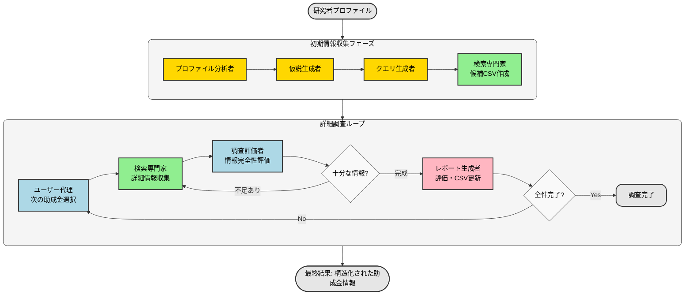

# FundingSearchCrew - 助成金検索エージェントアプリ ユーザーガイド

## 概要

FundingSearchCrewは、研究者のプロファイル情報をもとに最適な公募・助成金情報を自動的に検索するAIエージェントアプリケーションです。このアプリはStreamlitインターフェースを通じて、ユーザーフレンドリーな操作環境を提供します。本アプリはCrewAI（複数のAIエージェントが連携して作業を行うフレームワーク）を利用して、各専門エージェントが連携しながら助成金を検索・分析します。

## 主な機能

- 研究者プロファイルの分析（テキスト入力またはPDFアップロード）
- 自動助成金検索と情報抽出
- 助成金情報の構造化と優先順位付け
- 検索結果のcsv形式でのレポート生成
- エージェント別のモデル設定による最適な処理



## 動作環境要件

- Python 3.8以上
- インターネット接続
- 必要なAPI鍵:
  - Google API Key（検索用）
  - Google Custom Search Engine ID
  - Google Gemini API Key（AI処理用）

## セットアップ手順

### 1. リポジトリのクローン/ダウンロード

```bash
git clone https://github.com/LTS-AnalyticsTeam/grant_Agent.git
```

### 2. devcontainerの起動

リポジトリをdevcontainerで立ち上げてください。devcontainer環境では必要なライブラリが事前にインストールされています。

## 必要なAPIキーの取得方法

### Google API Key & Custom Search Engine ID

1. **Google Cloud Platformアカウント作成**
   - [Google Cloud Platform](https://console.cloud.google.com/)にアクセス
   - アカウント登録（Googleアカウントが必要）

2. **プロジェクト作成**
   - 「新しいプロジェクト」を選択
   - プロジェクト名を入力して「作成」

3. **Custom Search APIの有効化**
   - 左メニューから「APIとサービス」→「ライブラリ」
   - 「Custom Search API」を検索して選択
   - 「有効にする」をクリック

4. **APIキー発行**
   - 左メニューから「APIとサービス」→「認証情報」
   - 「認証情報を作成」→「APIキー」
   - 表示されたキーをコピー（Google API Key）

5. **Custom Search Engine設定**
   - [Programmable Search Engine](https://programmablesearchengine.google.com/create/new)にアクセス
   - サイト制限なし（全ウェブ検索）を選択
   - 検索エンジン名を入力して「作成」
   - 作成後、「コントロールパネル」→「基本」タブ
   - 「検索エンジン ID」をコピー（Google CSE ID）

### Google Gemini API Key

1. **Google AI Studioへアクセス**
   - [Google AI Studio](https://makersuite.google.com/app/apikey)を開く
   - Googleアカウントでログイン

2. **APIキーの作成**
   - 「API キーを取得」または「Create API Key」をクリック
   - 表示されたキーをコピー（Gemini API Key）

## アプリケーションの起動

```bash
cd crewai/dev_grant
./run.sh
```

または:

```bash
cd crewai/dev_grant
streamlit run streamlit_app.py
```

## アプリケーションの使用方法

### 1. APIキーの設定

1. 2ページ目の「API Settings」セクションに必要なAPIキーを入力
2. エージェント別のモデル設定（各タブで選択）
3. 検索する助成金の数を設定
4. AI処理の有効/無効を選択
5. 「Set API Keys」ボタンをクリック

### 2. プロファイル情報の入力

#### テキスト入力の場合:
1. 「Enter text」オプションを選択
2. テキストエリアに研究者プロファイル情報を入力
3. 「Save Profile」ボタンをクリック

#### PDFアップロードの場合:
1. 「Upload PDF」オプションを選択
2. 研究者プロファイルが含まれるPDFファイルをアップロード（複数可）
3. 処理方法を選択（順次処理または一括処理）
4. 「Process PDFs」ボタンをクリック
5. PDFの処理完了を待つ
6. テキスト入力に切り替えて、追加で修正することもできます

プロファイル例:
```
名前: 山田太郎
研究分野: 人工知能, 機械学習
所属: 東京大学
役職: 助教授
研究キーワード: 深層学習, 自然言語処理
国籍: 日本
学歴: 博士（工学）
```

### 3. 助成金検索の実行

1. 「Run Grant Search」ボタンをクリック
2. 検索処理の進行状況がリアルタイムで表示される
3. 処理完了後、右側のカラムに結果が表示される


## トラブルシューティング

### パス関連の問題

サイドバーの「Tools」セクションにある「Path Diagnostics」ボタンを使用して、現在のパス設定を確認できます。問題が検出された場合は「Reset Settings」をクリックしてリセットしてください。

### 一般的なエラー

- **PDFの処理エラー**: 別のPDFをアップロードするか、テキスト入力オプションを使用
- **API接続エラー**: インターネット接続を確認し、APIキーが正しいことを確認
- **実行エラー**: 「Path Diagnostics」を実行して構造問題を特定し、「Reset Settings」で修正
- **トークン制限エラー**: 大きなPDFや複数のPDFを処理する場合は「順次処理」オプションを選択
- **レート制限エラー**: 無料枠の場合は、flash-liteなどRPMが大きいものにモデルを変更してください

### crewai CLIの利用

アプリは内部で`crewai run`コマンドを使用します。このコマンドが利用できない場合は、自動的にPythonスクリプトを直接実行するフォールバックメカニズムが作動します。

## その他

詳細なドキュメントや問題報告については、プロジェクトのGitHubリポジトリを参照してください。

---

*注意: このアプリケーションは研究者向けの助成金検索をサポートするためのツールであり、検索結果の完全性や正確性を保証するものではありません。検索結果は必ず個別に確認してください。*