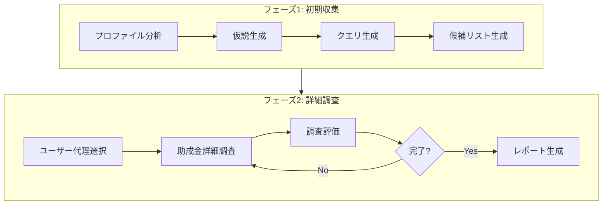

# Google ADK 助成金検索エージェント ユーザーガイド

## 概要

Google ADK 助成金検索エージェントは、研究者のプロファイル情報をもとに最適な助成金情報を自動的に検索するAIエージェントアプリケーションです。Google ADK (Agent Development Kit)を利用しており、複数のAIエージェントが連携しながら助成金を検索・分析します。

## 主な機能

- 研究者プロファイルの分析
- 自動助成金検索と情報抽出
- 助成金情報の構造化と優先順位付け
- 検索結果のCSV形式でのレポート生成
- エージェント別のモデル設定による最適な処理

## ワークフロー図

助成金検索プロセスは主に2つのフェーズで構成されています：

1. **初期収集フェーズ**
   - プロファイル分析
   - 仮説生成
   - クエリ生成
   - 候補リスト生成

2. **詳細調査フェーズ**
   - ユーザー代理選択
   - 助成金詳細調査
   - 調査評価
   - レポート生成




## 動作環境要件

- Python 3.10〜3.12
- インターネット接続
- 必要なAPI鍵:
  - Google API Key（検索用）
  - Google Custom Search Engine ID 
  - Google Gemini API Key（AI処理用）

## セットアップ手順

### 1. 必要なソフトウェアのインストール

#### VSCode (Visual Studio Code) のインストール

1. [Visual Studio Code公式サイト](https://code.visualstudio.com/)にアクセスします
2. お使いのオペレーティングシステム（Windows、Mac、Linux）に適したインストーラーをダウンロードします
3. ダウンロードしたインストーラーを実行し、画面の指示に従ってインストールを完了します

#### Docker のインストール

Docker は、アプリケーションを開発、移動、実行するためのプラットフォームです。

**Windows の場合:**
1. [Docker Desktop for Windows](https://docs.docker.com/desktop/install/windows-install/)をダウンロードします
2. インストーラーを実行し、指示に従ってインストールします
3. WSL 2 (Windows Subsystem for Linux 2)のインストールを求められる場合があります

**Mac の場合:**
1. [Docker Desktop for Mac](https://docs.docker.com/desktop/install/mac-install/)をダウンロードします
2. インストーラーをダブルクリックし、Applications フォルダにドラッグします
3. アプリケーションフォルダから Docker Desktop を起動します

**Linux の場合:**
1. [Docker Engine](https://docs.docker.com/engine/install/)のドキュメントに従ってインストールします

#### Dev Containers 拡張機能のインストール

1. VSCode を起動します
2. 左側のアクティビティバーで拡張機能アイコン（四角形のアイコン）をクリックします
3. 検索ボックスに「Dev Containers」と入力します
4. 「Dev Containers」拡張機能（Microsoft が提供）をクリックし、「インストール」ボタンをクリックします

### 2. リポジトリのクローン

1. VSCode を起動します
2. `Ctrl+Shift+P` (Windows/Linux) または `Cmd+Shift+P` (Mac) を押して、コマンドパレットを開きます
3. 「Git: Clone」と入力し、エンターキーを押します
4. リポジトリの URL を入力するよう求められたら、以下を入力します:
   ```
   https://github.com/LTS-AnalyticsTeam/grant_Agent.git
   ```

5. リポジトリを保存するローカルディレクトリを選択します

### 3. Dev Container での開発環境の起動

1. リポジトリがクローンされたら、VSCode でそのフォルダを開きます
2. VSCode の右下に「Reopen in Container」というポップアップが表示されます。これをクリックします
   - ポップアップが表示されない場合は、`Ctrl+Shift+P` (Windows/Linux) または `Cmd+Shift+P` (Mac) を押してコマンドパレットを開き、「Remote-Containers: Reopen in Container」と入力してエンターキーを押します
3. VSCode が Dev Container を構築し、リポジトリをコンテナ内で開きます。これには数分かかる場合があります
4. 一度コンテナが作成されれば、以降はサイドバーの Remote Explorer、上部タブの Dev Containers から grant-agent を選んでクリックすることで構築済みの環境に入ることができます

### 4. 必要なAPIキーの取得方法

#### Google API Key & Custom Search Engine ID の取得

1. **Google Cloud Platform アカウント作成**
   - [Google Cloud Platform](https://console.cloud.google.com/) にアクセスします
   - Googleアカウントでログインします（アカウントがない場合は作成してください）

2. **プロジェクト作成**
   - 上部のナビゲーションバーにあるプロジェクト選択ドロップダウンをクリックします
   - 表示されるダイアログで「新しいプロジェクト」をクリックします
   - プロジェクト名を入力して「作成」をクリックします

3. **Custom Search API の有効化**
   - 左側のナビゲーションメニューから「APIとサービス」→「ライブラリ」を選択します
   - 検索ボックスに「Custom Search API」と入力します
   - 検索結果から「Custom Search API」をクリックします
   - 「有効にする」ボタンをクリックします

4. **API キーの作成**
   - 左側のナビゲーションメニューから「APIとサービス」→「認証情報」を選択します
   - 上部の「+ 認証情報を作成」をクリックし、ドロップダウンから「APIキー」を選択します
   - 新しいAPIキーが生成されます。このキーをコピーして安全な場所に保存してください（これが Google API Key になります）
   - 必要に応じて「APIキーを制限」をクリックして、キーのセキュリティ設定を行うことができます

5. **Custom Search Engine の設定**
   - [Programmable Search Engine](https://programmablesearchengine.google.com/about/) にアクセスします
   - 「始める」または「Get started」をクリックします
   - 「新しい検索エンジン」または「Create a new search engine」をクリックします
   - 「検索するサイト」で「検索エンジンの検索対象」を「検索」または「Search the entire web」を選択します
   - 検索エンジン名を入力して「作成」をクリックします
   - 作成後、「コントロールパネル」や「Control Panel」から検索エンジンの設定ページに移動します
   - 「基本」タブで「検索エンジン ID」を見つけます。これをコピーして保存してください（これが Google CSE ID になります）

#### Google Gemini API Key の取得

1. **Google AI Studio にアクセス**
   - [Google AI Studio](https://makersuite.google.com/app/apikey) にアクセスします
   - Googleアカウントでログインします

2. **API キーの作成**
   - 「API キーを取得」または「Create API Key」をクリックします
   - 新しいAPIキーが生成されます。このキーをコピーして安全な場所に保存してください（これが Gemini API Key になります）

### 5. アプリケーションの環境設定

1. Dev Container 内で、ターミナルを開きます（VSCode のメニューから「ターミナル」→「新しいターミナル」）
2. 以下のコマンドを実行して、環境セットアップスクリプトを実行します:
   ```bash
   cd google-adk
   ./setup_env.sh
   ```
3. このスクリプトは必要な Python パッケージをインストールし、仮想環境を設定します

### 6. アプリケーションの起動

1. Dev Container 内のターミナルで、以下のコマンドを実行してアプリケーションを起動します:
   ```bash
   ./run_ui.sh
   ```
2. ブラウザで Streamlit アプリが自動的に開きます（通常は http://localhost:8501）

## アプリケーションの使用方法

### 1. API設定

1. サイドバーの「API設定」をクリックします
2. 以下のAPIキーを入力します:
   - GOOGLE_CSE_API_KEY: Google Cloud Platform で取得した API キー
   - GOOGLE_CSE_ID: Programmable Search Engine で取得した検索エンジン ID
   - GOOGLE_API_KEY: Google AI Studio で取得した Gemini API キー
3. 「設定を保存」ボタンをクリックします

### 2. LLM モデル設定

1. サイドバーの「LLMモデル設定」をクリックします
2. 各エージェントに使用する Gemini モデルを選択します:
   - profile_analyzer: プロファイル分析を行うエージェント
   - hypotheses_generator: 仮説を生成するエージェント
   - query_generator: 検索クエリを生成するエージェント
   - search_expert: 検索と情報抽出を行うエージェント
   - report_generator: レポートを生成するエージェント
   - user_proxy: ユーザー代理として働くエージェント
   - investigation_evaluator: 調査情報を評価するエージェント
3. 「設定を保存」ボタンをクリックします


### 3. プロファイル登録

1. サイドバーの「ユーザープロファイル」をクリックします
2. 研究者プロファイルを入力します:
   論文など自身の研究に関連するPDFアップロードし、geminiでプロファイルを自動生成することもできます。

   <details><summary>生成した架空のプロファイル例。</summary>

   ```txt
   **研究内容・興味**
   Takase Kは人工知能と神経科学の交差点における研究を専門としています。特に、人間の脳の情報処理メカニズムを計算論的にモデル化し、それを応用した新しいAIアルゴリズムの開発に強い興味を持っています。具体的には、以下のテーマを中心に研究を進めています。
   脳型AIアーキテクチャの設計と実装: 大脳皮質や海馬などの脳構造からヒントを得たニューラルネットワークモデルの構築。
   神経活動データに基づく機械学習モデルの検証: fMRIやEEGなどの脳計測データを用いて、開発したAIモデルの生物学的妥当性を評価。
   脳損傷後の機能回復を支援するAI: リハビリテーションや脳インターフェースへの応用を目指した研究。
   特に、脳がどのようにして複雑な情報を統合し、予測や意思決定を行っているのかという根源的な問いに対する計算論的なアプローチを探求しています。
   **過去の公募・助成金獲得情報**
   日本学術振興会 科学研究費助成事業 (科研費) 基盤研究(C) (代表) 「脳型強化学習における報酬信号の時空間的最適化に関する研究」 (20XX年度 - 20YY年度)
   国内学会優秀発表賞 (〇〇学会、20BB年)
   **研究実績**
   査読付き論文:
   Takase, K., et al. (20XX). A biologically plausible spiking neural network model for contextual learning. Nature Neuroscience (仮).
   Yamada, S., Takase, K., et al. (20ZZ). Decoding attentional states from EEG signals using a recurrent neural network with biological constraints. PLOS Computational Biology (仮).
   (その他、〇〇本以上の論文を発表)
   国際会議発表:
   Poster Presentation: "Towards a Computational Model of Hippocampal Replay in Reinforcement Learning." (Neural Information Processing Systems (NeurIPS), 20BB)
   著書・解説記事:
   共著: 『脳とAIの未来：計算論的神経科学からの展望』 (〇〇出版、20CC)
   解説記事: 「脳型コンピューティングの最前線」 (〇〇学会誌、Vol.〇, No.〇)
   研究拠点:
   〇〇大学 〇〇学部 〇〇研究科 (または、〇〇研究所)
   所属研究室：脳情報処理研究室 (仮)
   その他関連情報:
   〇〇学会 正会員
   〇〇学会 編集委員 (20XX年 - 現在)
   〇〇学会 〇〇部会 幹事 (20YY年 - 20ZZ年)
   〇〇企業との共同研究実績あり (テーマ：AIを活用した医療診断支援システム開発)
   大学院生、学部生の指導に熱心であり、後進の研究者育成にも力を入れている。
   研究成果を社会に還元することに関心があり、一般向けの講演活動なども積極的に行っている。
   ```
   </details>


### 4. 助成金検索の実行

1. サイドバーの「助成金検索実行」をクリックします
2. 調査する助成金数を設定します（1〜10の範囲）
3. 最小助成金候補数を設定します（5〜100の範囲）
4. 「助成金検索を実行」ボタンをクリックします
5. 検索処理の進行状況がリアルタイムでログウィンドウに表示されます

### 5. 結果の確認

1. サイドバーの「結果確認」をクリックします
2. 「候補リスト」タブで、検索された助成金候補の一覧を確認できます
3. 「詳細調査済み」タブで、詳細調査が完了した助成金の情報を確認できます
4. 必要に応じて CSV ファイルをダウンロードできます
5. 実行ログを確認し、必要に応じてダウンロードすることもできます

## トラブルシューティング

### API キーに関する問題

- **エラーメッセージ: "API Key or CSE ID not configured"**: API設定ページで正しいAPIキーを入力しているか確認してください
- **検索結果が表示されない**: Google Cloud Platform のコンソールで Custom Search API が有効になっているか確認してください

### 実行エラー

- **プロファイル読み込みエラー**: プロファイルテキストが正しく入力されているか確認してください
- **モジュールインポートエラー**: setup_env.sh スクリプトを再実行して、すべての依存関係が正しくインストールされていることを確認してください
- **ディレクトリやファイルが見つからない**: アプリケーションのルートディレクトリから実行していることを確認してください
- **500エラー**:　APIキーのレート制限に達しています。より小型のモデルを使用するか、従量課金プランを検討してください（1回の実行であれば数十円程度です）

### Streamlit UI の問題

- **UIが応答しない**: ブラウザをリフレッシュするか、アプリケーションを再起動してください
- **ログが表示されない**: ログディレクトリが正しく作成されていることを確認してください

## ヒントとコツ

- 研究者プロファイルはできるだけ詳細に入力すると、より関連性の高い助成金が見つかります
- 複数回の検索を行うことで、より多くの助成金候補を見つけることができます
- 各エージェントのモデルを調整することで、検索の精度と速度のバランスを最適化できます
- 検索結果のCSVファイルは、スプレッドシートソフトで開いて詳細に分析することができます

## プライバシーとセキュリティ

- APIキーは環境変数として保存され、.env ファイルに格納されます
- 検索結果やログは、ローカルのディレクトリにのみ保存されます
- 研究者プロファイル情報は Google のサービスに送信されますが、Google のプライバシーポリシーに従って処理されます。  
**研究機密や公開したくない個人情報を入力しないように注意してください。**

---

*注意: このアプリケーションは研究者向けの助成金検索をサポートするためのツールであり、検索結果の完全性や正確性を保証するものではありません。検索結果は必ず個別に確認してください。*